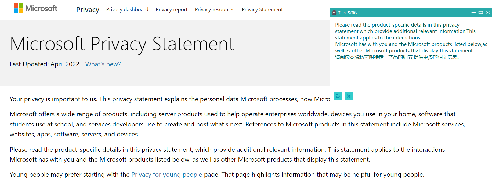

# TransEXTify
截取图片并识别出图片的文字并翻译

# 依赖
* pip install pyQt5
* pip install QCandyUi
* pip install baidu-aip 或 pip install easyocr

# 使用说明
- 有两种ocr工具：easyocr和百度的api，TransEXTify.py中可选择
- 百度api需要自己的百度api的id等
- 可直接将待识别图片拖拽到该应用的空白处
- 也可以进行截屏识图, 按下底下的截屏按钮或者快捷键alt

